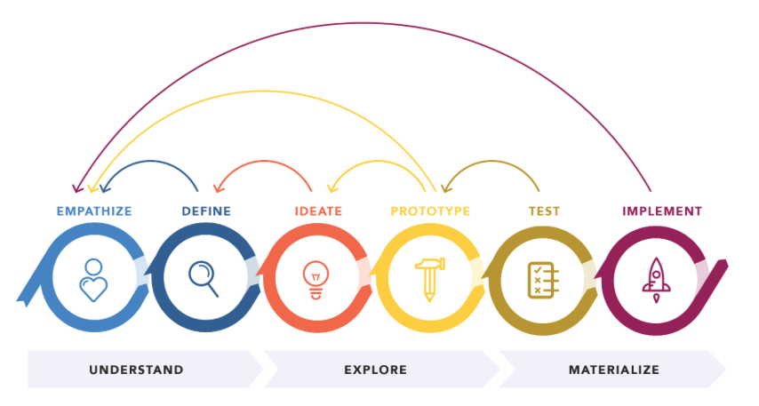
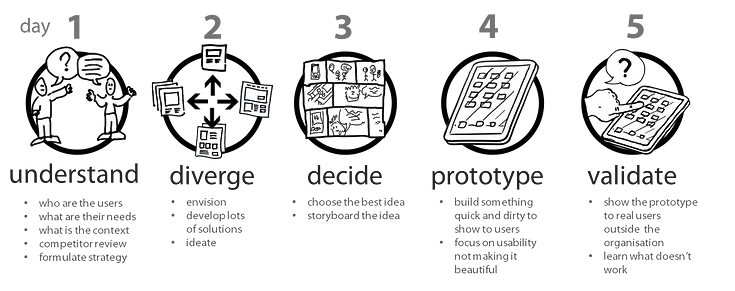

# 1.a Technical Interaction Design[^online]
[^online]: Latest version of this document at https://github.com/itu-tid/

_**“I saw the angel in the stone and I carved until I set it free.”**_ **– Michelangelo (1475 – 1564)**

## An Iterative Discovery and Creation  Process

The following are two popular alternative definitions of ID:

> *ID is the practice of designing interactive digital products, environments, systems, and services*. (Alan Cooper, About Face)

> *Designing interactive products to support the way people communicate and interact in everyday and working lives*. (Preece et. al, Interaction Design)

ID is a creative process, and like any creative process
- has to be developed with a given set of constrains and 
- has to be done in an iterative manner

Unlike other design disciplines (logo design, visual design, etc.) interaction design it is focused as much on *behavior* as on form.

As you can imagine, based on these definitions, interaction design is a very broad domain. E.g. CHI -- the main international conference where researchers working in human-computer interaction meet to discuss the latest findings. At one of the last such conferences I attended the topics ranged from: smart shoes, to smart pills that you could track as they traversed your digestive tract, to "5D" games, to adaptable systems for language learning (this, the least futuristic one, was my work). 

## How to design a successful Interaction?
Every year an incredible large number of apps is created, and only a few of them are successful. So what makes some apps more successful than others? 

Think about:
 - How many apps do you have installed on your phone? how many apps are out there?
 - How many products did Google have? How many were eventually discontinued? (https://killedbygoogle.com/)
 - How many startups set out to disrupt and revolutionize the world? How many actually do this? 

> In Class Interactive Exercise: Think about a Shopping List app. What unique features would you add to it to make it stand out? 

Every app is a point in a very large design and feature space. Both design and functionality have incredibly high dimensions. And many of the points in that space are unsuccessful. Finding the right point in that feature and behavior space is a difficult challenge. And ... it's better if you iterate. 

If we think about what the successful products, they usually solve a problem. They offer us value. And most often they also do it in an efficient and pleasant way. Indeed, in a category with many competing products offering the same functionality, the ones that simpler to use, or more pleasant to use, are preferred. 

Thus, we introduce the distinction between: *usefulness* and *usability* ([Laundauer]): 

* **usefulness** = value delivered to the user. To have something that is useful it requires understanding humans and their context; and understanding their problems; their specific problems; and making sure that you fit in their workflow; and it is more important than usable; but it's also harder; 

* **usability** means that the digital artifact is pleasant; and easy to use; not cumbersome; and not annoying to the user; and positive emotions in the user [Emotional Design, D. Norman]; some people consider usability to be an [excavator of usefulness](https://bitzesty.com/2014/05/15/usability-and-usefulness-in-ux-web-design/).

Note that sometimes, usability is just a nice to have thing; and other times it's a matter of life and death. The story of the car gear [shifter in which the state was not visible](https://uxdesign.cc/the-usability-issue-that-caused-1-death-and-38-injuries-97911dfa5c7f). Or the low usability of the plane controls that lead to the [death of John Denver](https://www.ntsb.gov/news/press-releases/Pages/NTSB_Determines_John_Denvers_Crash_Caused_by_Poor_Placement_of_Fuel_Selector_Handle_Diverting_His_Attention_During_Flight.aspx).  

It seems that delivering something useful and usable are both important. But how to do that? 

- For Usefulness one must understand your users and their needs. Think about movies - how do they select their audience?
- For Usability one must be aware of usability principles but also know how to evaluate with actual users 

One good place to start from is knowing who your users are. Designing for the average user means frustrating most of the users. [The Flaw of the Averages](https://www.thestar.com/news/insight/2016/01/16/when-us-air-force-discovered-the-flaw-of-averages.html)

## Specific Processes & Approaches

Given the importance of designing interactions in the world we live in and our fondness of having a "process" for everything we do (SCRUM anybody?) you can imagine why many people would try to provide recipes for how to do Interaction Design. And indeed, there are many processes for ID. The most popular one, and the one from one of the most popular company out there are: 
 
#### **Design Thinking** 
An ideology that asserts that a hands-on, user-centric approach to problem solving can lead to innovation [DT]. Process comprises 6 distinct phases. 

#### **Google Design Sprints** 
A process that starts from from ideation to prototyping and evaluation but explcitly without implementation [GDS]. 

	 - [1min summary video](https://www.youtube.com/watch?v=QwJwemOX37w)
	 - [10 min overview video](https://www.youtube.com/watch?v=WWEJCLkf1D4)

All of the processes are iterative. And, most of them, including the ones above, have several high-level activities in common: 

 - understanding - collecting data about the users and the problem that needs to be solved
 - generating alternatives - getting creative in discovering solutions to the problems; brainstorming
 - prototyping - trying out stuff as early and as cheaply as possible
 - evaluating - getting feedback from representative users; observing them

Different approaches put different emphasis on the different kinds of phases but all the phases are important. In every phase, there are different kinds of activities. 

Finally, most processes will make a distinction between phases in which one searches for solution and phases in which these solutions are reduced and evaluated. This is the main idea behind the  **Double Diamond Model** - a process model created by Design Council, a British organization, in 2005. It highlights four main stages across two adjacent diamonds:
- **Discover**. The first diamond helps people understand, rather than simply assume, what the problem is
- **Develop**. The second diamond encourages people to give different answers to the clearly defined problem

Finally, although not as process-driven, there are other approaches can also work sometimes: 

 - **Wizard Design** - this is what Steve Jobs used to do. He had a very strong intuition of what people needed and created it for them. Henry Ford: "if you ask people, they will want a faster horse".
 
- **Design for yourself** - this is what the authors of Vi, LaTeX, etc. set out to do. Solving a problem that they had. And then, it turned out, that other people also had that problem. Is this a more or less risky approach than Design-Driven Innovation? 

# *Technical* Interaction Design

This course is about *technical* ID. This means that we focus much more on the technical aspects of creating interactions. In particular we will discuss several technologies that you will likely need for the foreseeable future if you want to create any interactive application: 

- Javascript - We will go together in the first weeks through the important parts just to make sure that everybody is onboard when we hit the React "wall". 

- CSS - We will cover some of the essential layout-related topics together; I expect you to have a basic understanding of it; however you'll see - it's more stuffy that it looks

- React - We will cover everything from beginner to advanced topics

- Git - A collaboration tool that you can not live without 

These technologies are useful for almost any web development project and also for many mobile applications at the moment. E.g., React Native is very similar to React and allows you to build cross-platform applications.

# Project Work

- Form teams 
- Choose your project theme:  [Project-Themes](Project-Themes.md)
- Think about a special kind of user for which you want to target the application for
	- Be smart. You should have access to discuss with this kind of user 
		1. before designing, to understand requirements, but also 
		2) once the design is done, to evaluate your solution

## References

[Laundauer] - The Trouble with Computers: Usefulness, Usability, and Productivity, Laundauer. [pp.141 -- 142](https://www.ics.uci.edu/~redmiles/ics227-SQ04/papers/Lan95.pdf). 

[DT] [Design Thinking 101](https://www.nngroup.com/articles/design-thinking/), Sara Gibbons. 

[GDS] [How Google Design Sprint Works](https://agilemarketing.net/google-design-sprints/) Thaisa Fernandes, 5min read.

