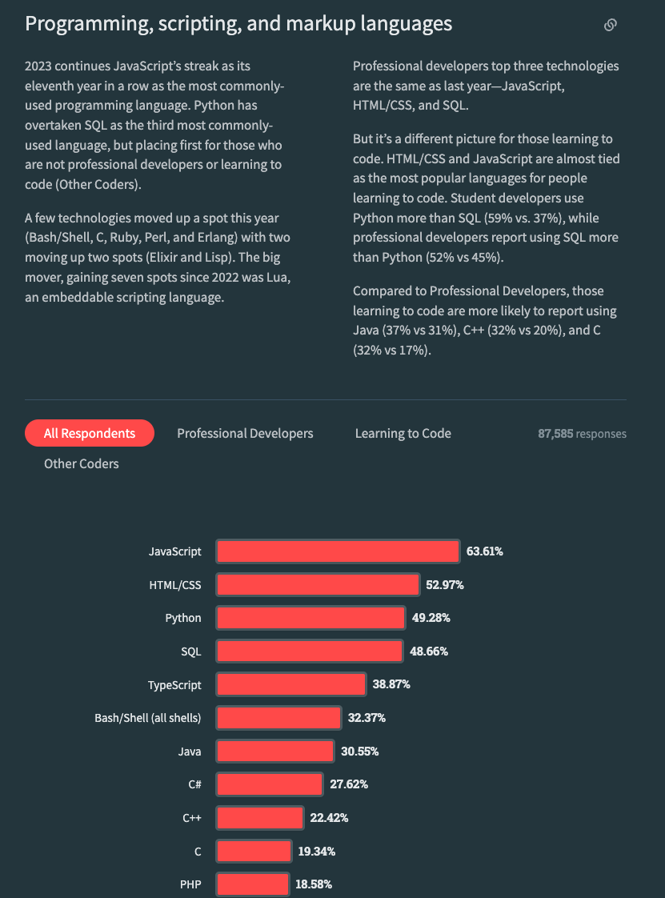

(source: [StackOverflow developer survey](https://survey.stackoverflow.co/2023/#programming-scripting-and-markup-languages))

## Why the popularity? 

**Versatility**. With JS, as of 2023, you can building quite a few things besides interactive web apps: 
- web servers (Node.js), 
- browser extensions, 
- services, desktop apps (electron), 
- games (WebGL), IoT etc. 

**Portability**. Available on every device with a browser or a node.exe. 

**Speed**. It's fast. 

Variant: TypeScript. 

## The Language 

Look at the following code, from a [tutorial](https://replicate.com/blog/how-to-prompt-llama) on how to use Large Language Models. Do you understand it? It illustrates a few of the main features of JS points of today's discussion: 

```javascript

const messageHistory = [...messages];

messageHistory.push({
  text: userMessage,
  isUser: true,
});

const generatePrompt = (history) => {
      return messages
        .map((history) =>
          message.isUser
            ? `[INST] ${message.text} [/INST]`
            : `${message.text}`
        )
        .join("\n");
    };
```
(Context of the [code](https://github.com/replicate/llama-chat/blob/main/app/page.js#L73))

## Language Basics

- Read the [Language Basics](https://developer.mozilla.org/en-US/docs/Web/JavaScript/Guide/Grammar_and_types#basics) article and make sure that you can answer the following questions: 
	- **Basics**
		- Is JS case sensitive? Can you use unicode in identifier names? What about string values? 
	- **Declarations**
		- What's a global and what's a local variable? ([see](https://developer.mozilla.org/en-US/docs/Web/JavaScript/Guide/Grammar_and_types#variable_scope))
		- What is the difference between `var`, `let`, and `const`? ([see](https://developer.mozilla.org/en-US/docs/Web/JavaScript/Guide/Grammar_and_types#declarations) [also](https://developer.mozilla.org/en-US/docs/Web/JavaScript/Reference/Statements/block))
		- What is block scope? What other scopes are there? 
		- How do you define a variable global to a file?
		- How do you define a variable that is only visible within a function scope? 
	- **Data Types**
		- What are the seven data types in JS? ([see](https://developer.mozilla.org/en-US/docs/Web/JavaScript/Guide/Grammar_and_types#data_types))
		- What does it mean that JS is dynamically typed? ([see](https://developer.mozilla.org/en-US/docs/Web/JavaScript/Guide/Grammar_and_types#data_type_conversion))
		- What happens when you use the `+` operator on a number and a string? What about the `*` operator ? ([see](https://developer.mozilla.org/en-US/docs/Web/JavaScript/Guide/Grammar_and_types#numbers_and_the_operator))
		- [How do you convert a string to a number](https://developer.mozilla.org/en-US/docs/Web/JavaScript/Guide/Grammar_and_types#converting_strings_to_numbers)?
		- Object literals? What is an object in JS?
	- **Literals**
		- How to define an Array literal? ([see](https://developer.mozilla.org/en-US/docs/Web/JavaScript/Guide/Grammar_and_types#array_literals))
		- How to define an Object literal? ([see](https://developer.mozilla.org/en-US/docs/Web/JavaScript/Guide/Grammar_and_types#array_literals))
		- What are *template literals* and when do you use them? ([see](https://developer.mozilla.org/en-US/docs/Web/JavaScript/Guide/Grammar_and_types#string_literals))

## Loops and Iterations
- [for statement](https://developer.mozilla.org/en-US/docs/Web/JavaScript/Reference/Statements/for)
- [while](https://developer.mozilla.org/en-US/docs/Web/JavaScript/Reference/Statements/while)
- [for...in...](https://developer.mozilla.org/en-US/docs/Web/JavaScript/Reference/Statements/for...int)
	- does this iterate over the keys or the values of an object? 
	- why is this not appropriate for arrays?
	- what is the right way to iterate over an array? 
- [for ... of ...](https://developer.mozilla.org/en-US/docs/Web/JavaScript/Reference/Statements/for...of)
	- does this iterate over the keys of an object or the values of an iterable? 
	- how do you iterate over the values in a Map? 
- [discussion](https://stackoverflow.com/a/29286412/1200070) on SO on the difference between `for ... in` and `for ... of`

## Expressions and Operators
- [Comparison Operators](https://developer.mozilla.org/en-US/docs/Web/JavaScript/Guide/Expressions_and_operators#comparison_operators) - must read
	- Why is there a need for a strict equality ([`===`](https://developer.mozilla.org/en-US/docs/Web/JavaScript/Reference/Operators/Strict_equality)) and a strict inequality operator ([`!==`](https://developer.mozilla.org/en-US/docs/Web/JavaScript/Reference/Operators/Strict_inequality))? 
- [Logical Operators](https://developer.mozilla.org/en-US/docs/Web/JavaScript/Guide/Expressions_and_operators#logical_operators)
- [Ternary Operator](https://developer.mozilla.org/en-US/docs/Web/JavaScript/Guide/Expressions_and_operators#conditional_ternary_operator)


## Functions

Read up 
* How to declare a function? ([see](https://developer.mozilla.org/en-US/docs/Web/JavaScript/Guide/Functions))
* How to declare a function expression? ([see](https://developer.mozilla.org/en-US/docs/Web/JavaScript/Guide/Functions#function_expressions))
* What is the difference between a named function expression and an unnamed function expression?
* Can variables inside of a function be accessed outside of it? What about those outside of the function, can they be accessed inside it? ([see](https://developer.mozilla.org/en-US/docs/Web/JavaScript/Guide/Functions#function_scope))
- What is an arrow function? ([Arrow Function Expressions](https://developer.mozilla.org/en-US/docs/Web/JavaScript/Reference/Functions/Arrow_functions))

## Arrays
- [map](https://developer.mozilla.org/en-US/docs/Web/JavaScript/Reference/Global_Objects/Array/map) 
- [filter](https://developer.mozilla.org/en-US/docs/Web/JavaScript/Reference/Global_Objects/Array/filter) 
- Mutable treatment of arrays (changing an existing object)
		- [push](https://developer.mozilla.org/en-US/docs/Web/JavaScript/Reference/Global_Objects/Array/push) - adding at the end
		- [pop](https://developer.mozilla.org/en-US/docs/Web/JavaScript/Reference/Global_Objects/Array/pop) - removes from the end
		- [splice](https://developer.mozilla.org/en-US/docs/Web/JavaScript/Reference/Global_Objects/Array/splice) - changes contents starting with given index
- [Spread Syntax](https://developer.mozilla.org/en-US/docs/Web/JavaScript/Reference/Operators/Spread_syntax) , e.g.`[...artists]`
	- Immutable treatment of arrays (creating a new object)
		- Adding an element to an array with the spread operator: `[...artists, {id:"mich", name: "Michelangelo"}]`. 
		- Removing an element from an array: `artists.filter(a => a.id !== "mich")`
	